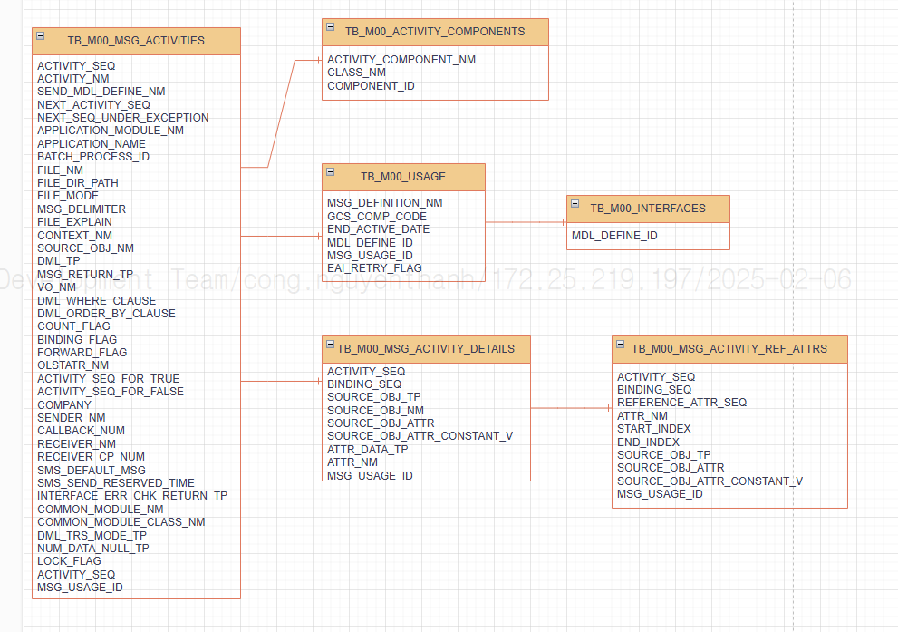

TB_M00_MSG_ACTIVITIES.MSG_USAGE_ID = TB_M00_USAGE.MSG_USAGE_ID

TB_M00_MSG_ACTIVITIES.COMPONENT_ID = TB_M00_ACTIVITY_COMPONENTS.COMPONENT_ID

TB_M00_MSG_ACTIVITIES.MSG_USAGE_ID = TB_M00_MSG_ACTIVITY_DETAILS.MSG_USAGE_ID
TB_M00_MSG_ACTIVITIES.ACTIVITY_SEQ = TB_M00_MSG_ACTIVITY_DETAILS.ACTIVITY_SEQ

TB_M00_MSG_ACTIVITY_DETAILS.MSG_USAGE_ID = TB_M00_MSG_ACTIVITY_REF_ATTRS.MSG_USAGE_ID
TB_M00_MSG_ACTIVITY_DETAILS.ACTIVITY_SEQ = TB_M00_MSG_ACTIVITY_REF_ATTRS.ACTIVITY_SEQ
TB_M00_MSG_ACTIVITY_DETAILS.BINDING_SEQ = TB_M00_MSG_ACTIVITY_REF_ATTRS.BINDING_SEQ

TB_M00_USAGE.MDL_DEFINE_ID = TB_M00_INTERFACES.MDL_DEFINE_ID 

