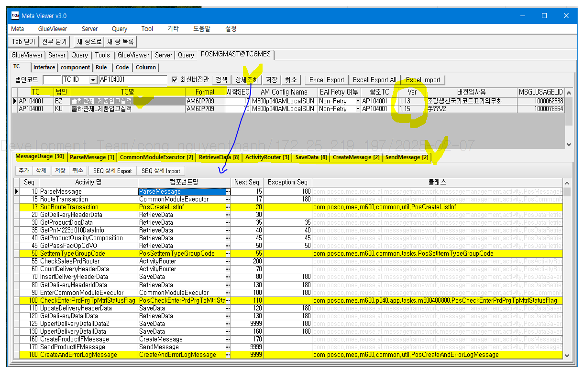
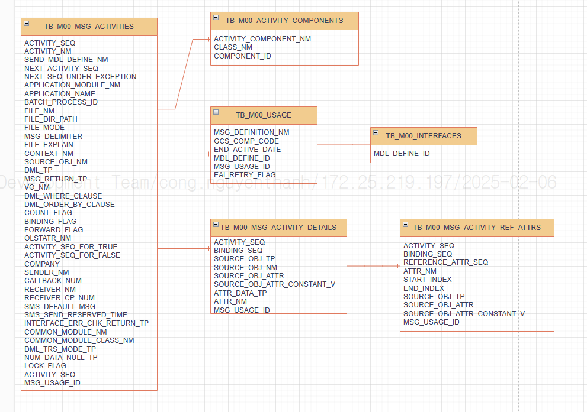
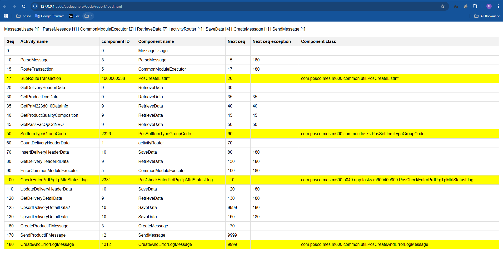

```
TB_M00_MSG_ACTIVITIES.MSG_USAGE_ID = TB_M00_USAGE.MSG_USAGE_ID

TB_M00_MSG_ACTIVITIES.COMPONENT_ID = TB_M00_ACTIVITY_COMPONENTS.COMPONENT_ID

TB_M00_MSG_ACTIVITIES.MSG_USAGE_ID = TB_M00_MSG_ACTIVITY_DETAILS.MSG_USAGE_ID
TB_M00_MSG_ACTIVITIES.ACTIVITY_SEQ = TB_M00_MSG_ACTIVITY_DETAILS.ACTIVITY_SEQ


TB_M00_MSG_ACTIVITY_DETAILS.MSG_USAGE_ID = TB_M00_MSG_ACTIVITY_REF_ATTRS.MSG_USAGE_ID
TB_M00_MSG_ACTIVITY_DETAILS.ACTIVITY_SEQ = TB_M00_MSG_ACTIVITY_REF_ATTRS.ACTIVITY_SEQ
TB_M00_MSG_ACTIVITY_DETAILS.BINDING_SEQ = TB_M00_MSG_ACTIVITY_REF_ATTRS.BINDING_SEQ

TB_M00_USAGE.MDL_DEFINE_ID = TB_M00_INTERFACES.MDL_DEFINE_ID 


** Master:
TC
법인 (corporation)
TC명 (name)
Format
시작SEQ (Start SEQ)
AM Config Name
EAI retry 여부 (EAI retry or not)
참조TC (Reference TC)
ver
버전업 사유 (Reason for version upgrade)
MSG_USAGE_ID

*** Detail:
SEQ
Activity 명 (activity name)
컴포넌트명 (component name)
Next SEQ
Exception SEQ
클래스 (class)
```


